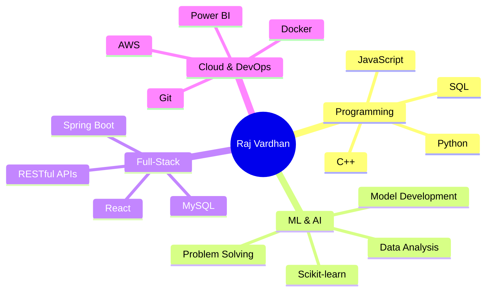
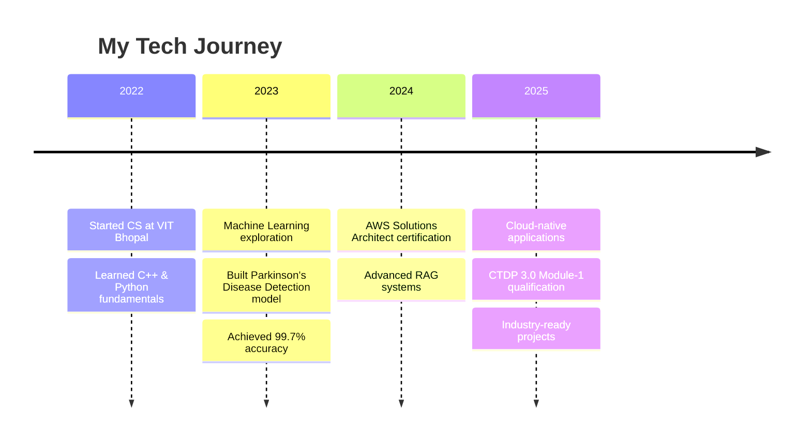

# 👋 Hi, I'm Raj Vardhan!.

  

  

📧 **af.aj601@gmail.com** •  **+91-87897-49366**

---

##  About Me

🎓 **Computer Science Engineering Student** at VIT (2022-2026).
💡 **Passionate** about Machine Learning and Cloud Technologies.  
🏆 **Qualified** for PwC CTDP 3.0 Module-1 - demonstrating advanced technical competency  
♟️ **Chess enthusiast** who loves international affairs and cooking  

---

## 🛠️ Technical Arsenal

### Programming Languages

### Frameworks & Libraries

### Tools & Technologies

### Specializations

---

## 🏆 Achievements & Certifications

<table>
<tr>
<td width="50%">

###  Major Achievements
- 🥇 **CTDP 3.0 Qualified** - PwC Cloud Technology Development Programme
- 🌟 **NPTEL Elite + Silver** - Cloud Computing excellence

</td>
<td width="50%">

### 📜 Professional Certifications
- 🔧 **NPTEL Cloud Computing** - Elite + Silver
- 🌍 **Computer Networking** - Coursera
- 🐍 **Programming with Python 3.X** - Simplilearn
-  Oracle Cloud Infrastructure 2025 Certified AI Foundations Associate.

</td>
</tr>
</table>

---

## 📊 GitHub Analytics

---

## 💡 What I'm Currently Working On

🔭 **Exploring**: Advanced RAG architectures and Vector Databases  
🌱 **Learning**: Cloud-native applications with Kubernetes  
👯 **Looking to collaborate**: On Machine Learning and Full-Stack projects  
🎯 **Goal**: Contributing to open-source AI/ML projects  
💬 **Ask me about**: Python, Machine Learning, AWS, Full-Stack Development  

---

##  Skills Visualization

---

##  Learning Journey

---

### 💖 Thanks for visiting my profile!

**"Coding is not just about solving problems, it's about creating solutions that make a difference!"**

⭐ **Star my repositories if you find them interesting!**  
🤝 **Let's connect and build something amazing together!**

---

  

